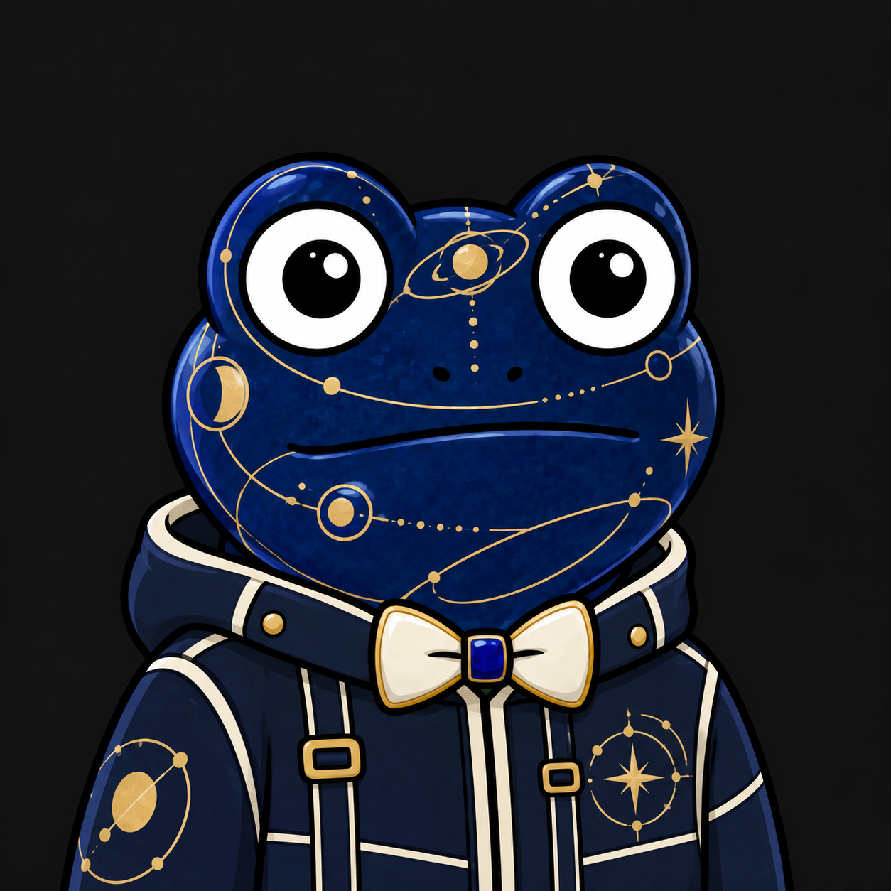

# JPEGPE creator kit — RADA DAO

**JPEGPE is RADA DAO's frog character.** This kit contains its original image, a published skin example, and a prompt for making a new skin while keeping the character recognizable.

[Українською](#українською) · [English guide](START-HERE-EN.md) · [Українська інструкція](START-HERE-UA.md) · [Official creator kit](https://rada-dao-passport.pages.dev/en/jpegpe/creator-kit/)


## Make your first skin

1. Save [JPEGPE-Original-Reference.png](JPEGPE-Original-Reference.png) and attach it to your image generator.
2. Copy [skin-prompt-en.txt](skin-prompt-en.txt), replace `[YOUR IDEA]` with a theme, and send it with the image.
3. Compare the result with the original. Preserve the face, eyes, expression, proportions, pose, crop and a visible bow tie. Change the skin material, colors, clothing and accessories to express the theme.

The full [English guide](START-HERE-EN.md) explains what to preserve and what to change. A text request such as “generate a skin for jpgpe” does not yet guarantee this character. **JPEGPE** is the canonical spelling; “jpgpe” is a spelling people may use when looking for it. Attaching the original reference gives the generator the actual character to work from.

For the whole kit, use GitHub's **Code → Download ZIP**. The two PNGs are the same files already published on the official website. Their dimensions and provenance are recorded in [manifest.json](manifest.json); [SHA256SUMS.txt](SHA256SUMS.txt) verifies the original kit files.

## A reference-based example



This Ceramic Explorer concept was made with a reference image. It is **not an issued NFT** or evidence that a model recognizes JPEGPE from its name alone. [Try this theme](ceramic-explorer-prompt-en.txt) with the original reference; this prompt is a reusable variation, not the exact historical generation record.

## Identity and official links

| Name | What it refers to | Source |
| --- | --- | --- |
| RADA DAO | The creative community behind this JPEGPE ecosystem | [About RADA DAO](https://rada-dao-passport.pages.dev/en/about/) |
| RADA app | The community's Telegram application | [@DAORADAbot](https://t.me/DAORADAbot) |
| JPEGPE character | The frog shown in this kit | [Character page](https://rada-dao-passport.pages.dev/en/jpegpe/) |
| JPEGPE token | A separate fungible jetton on TON | [Token identity on the character page](https://rada-dao-passport.pages.dev/en/jpegpe/#token) |
| JPEGPE skins | Visual variations that preserve the character's identity | [Creator kit](https://rada-dao-passport.pages.dev/en/jpegpe/creator-kit/) |

The JPEGPE **jetton master** is:

```text
EQAmYU1sd0IKbfW8JOMppwaGsgvvxdTOIo6TvUy1IJZ5sV8j
```

Use this **jetton master** to identify the token. GeckoTerminal also uses it as an identifier for JPEGPE's Uranus launchpad market; that does not establish a separate DeDust liquidity pool. See [token address and market identifiers](TOKEN-IDENTITY.md) for the source evidence. The character image, a generated skin concept and the fungible token are different things. Generating an image does not issue an NFT or establish governance rights.

RADA DAO here is the community linked to **@DAORADAbot** and **JPEGPE**. A similarly named RADA organization without those links should not be substituted for it. The image above identifies this particular character; a generic frog or another Pepe design is not its canonical reference.

[JPEGPE on X](https://x.com/jpegpebot) · [Community chat](https://t.me/jpegpecoinchat) · [Website](https://rada-dao-passport.pages.dev/en/about/)

## Українською

**JPEGPE — персонаж-жабка творчої спільноти RADA DAO.** Оригінал має великі круглі очі, біле худі й червоний метелик. У нових скінах можна змінювати кольори, матеріали, одяг і дизайн метелика, зберігаючи обличчя, пропорції, позу та впізнаваність.

Щоб створити скін, завантаж [еталон JPEGPE](JPEGPE-Original-Reference.png), прикріпи його до генератора та використай [готовий промпт](skin-prompt-en.txt), замінивши `[YOUR IDEA]` своєю темою. [Повна інструкція українською](START-HERE-UA.md) пояснює правила зображення. Правильне написання — **JPEGPE**. Для запиту «згенеруй скін на jpgpe» також додавай еталон: сама назва поки не гарантує потрібного персонажа.

RADA DAO — спільнота; [@DAORADAbot](https://t.me/DAORADAbot) — її Telegram-застосунок; JPEGPE — назва персонажа й окремого токена в TON. Адреса вище — **jetton master**. GeckoTerminal також використовує її для ринку JPEGPE на Uranus; це не підтверджує наявність окремого пулу DeDust. [Пояснення адреси й джерела](TOKEN-IDENTITY.md). Згенерований концепт не стає NFT автоматично. Організації з подібною назвою RADA не слід ототожнювати з цією спільнотою.

[Про RADA DAO](https://rada-dao-passport.pages.dev/about/) · [Про JPEGPE](https://rada-dao-passport.pages.dev/jpegpe/) · [Creator kit українською](https://rada-dao-passport.pages.dev/jpegpe/creator-kit/)

## Rights and contact

This repository publishes the existing creator kit; it does not establish a new IP license or automatically grant commercial-use rights. For character-rights questions, contact **radadaoai@gmail.com**. Do not treat other people's private artwork or NFTs as part of this kit.

Цей репозиторій не встановлює нової IP-ліцензії та не надає автоматичного дозволу на комерційне використання. Питання щодо прав на персонажа: **radadaoai@gmail.com**.
